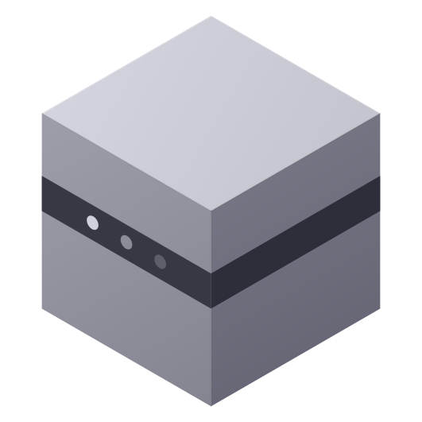

# Unity Builder Dash


A native GNOME (GTK4 + Libadwaita) desktop application for building, deploying, profiling and managing Unity projects and Android devices.

## Features

### Projects
- **Build** multiple Unity projects (Android APK, iOS Xcode) with one click
- **iOS Remote Build** — build iOS on a remote Mac over SSH (zip → scp → xcodebuild). See [server/README.md](server/README.md) for Mac-side setup.
- **Build All** — sequential builds across all configured projects
- **Run Tests** — EditMode and PlayMode tests via Unity Test Runner (batchmode)
  - Real-time progress counter, ETA based on previous runs
  - NUnit XML result parsing with pass/fail/skip summary
  - Failed test details with error messages
- **Real-time build log** — colored output with search, level filter, word wrap, copy
- **Progress bar** with ETA based on previous builds
- **Auto-increment toggle** — build with or without version bump
- **Clean Build** — delete Library/Bee folders from context menu
- **Upload to server** — FTP upload with per-project host, directory, and rename pattern
- **Deploy to device** via [APK Dash](https://github.com/PavelKhabusov/APK-Dash) integration
- **Drag & drop APK** — drop .apk onto Devices tab to install
- **Desktop notifications** on build completion

### Devices
- **Device manager** — list connected USB/WiFi devices via ADB
- **Wireless connect/disconnect** by IP
- **App management** — list installed third-party apps with version, install/update date
  - Force stop, clear data, uninstall with confirmation
  - Manage runtime permissions (grant/revoke with switches)
  - Open profiler for specific app
  - Search/filter apps
- **Install APK / Push file** to device
- **Drag & drop APK** — drop .apk file to install on first connected device
- **Screenshot** — capture and open
- **Cast (scrcpy)** — screen mirroring via scrcpy
- **Device Info** — model, Android version, CPU, storage, display resolution
- **Inline logcat** — real-time log viewer with app filter, level filter, search, pause, copy
- **Shell** — open terminal with `adb shell`
- **Files** — open native file manager (MTP)
- **WiFi / Airplane mode** toggle
- **Restart ADB / Kill MTP** conflicts

### History
- **Tabs: Builds / Tests** — separate views with dedicated charts
- **Build chart** — duration + APK size over time (smooth lines)
- **Test chart** — passed/failed stacked bars per run
- **Filters** — by project, success only, X axis (build #/time)
- **Built-in log viewer** — open logs in-app with search, filter, copy

### Profiler
- **Real-time performance monitoring** with live charts
- **Metrics:** FPS, Frame Time, GPU %, RAM (PSS), CPU %, Temperature
- **Meta Quest support** — VrApi logcat stream for GPU/CPU level, stale frames, FFR, DSF, App GPU time, SoC temp
- **Device + app selection** with auto-detection of running apps
- **Battery** level and temperature in status bar

### Settings
- Per-project Unity version override, custom build directory
- Hide ADB during build (~2 min faster)
- Upload config per project (FTP host, user, password, rename pattern)
- Theme — System / Dark / Light with live preview
- Auto-detect Unity Editor and APK Dash paths

### General
- **Sidebar navigation** — Projects, Devices, History, Profiler, Settings
- **GNOME native** — Adwaita widgets, NavigationSplitView, dark theme
- **Project health check** — version, Cloud ID, build scenes, errors, git status

## Requirements

- Python 3.10+
- GTK4 and Libadwaita
- Unity Editor with Android/iOS build support
- ADB (Android Debug Bridge) for device features
- [APK Dash](https://github.com/PavelKhabusov/APK-Dash) (optional, for device deployment UI)

### Arch Linux
```bash
sudo pacman -S python-gobject gtk4 libadwaita android-tools
```

### Ubuntu / Debian
```bash
sudo apt install python3-gi gir1.2-gtk-4.0 gir1.2-adw-1 adb
```

## Setup

1. Clone the repository:
```bash
git clone https://github.com/PavelKhabusov/Unity-Builder-Dash.git
cd Unity-Builder-Dash
```

2. Copy and edit the config:
```bash
cp config.example.json config.json
```

3. Run:
```bash
./build.py
```

On first launch with no config, Settings opens automatically with auto-detection of Unity Editor path.

### Desktop entry (optional)

To get a proper GNOME launcher entry with the right icon:
```bash
./install.sh             # installs to ~/.local/share/applications/
./install.sh --system    # system-wide (needs sudo)
./install.sh --uninstall
```
The script detects the repo path at install time, so no path hardcoding.

### iOS remote build

If you build iOS on a remote Mac, see [server/README.md](server/README.md) for
the one-time Mac setup. After that, the iOS button in the app opens a popup
that orchestrates: Unity build → zip → scp → xcodebuild on Mac, with full log
streaming back into the app's LogView.

## Unity BuildScript

Place this in `Assets/Editor/BuildScript.cs` of each project:

```csharp
using UnityEditor;
using UnityEditor.Build;
using UnityEditor.Build.Reporting;
using System.Linq;

public static class BuildScript {

    private static string[] GetScenes() =>
        EditorBuildSettings.scenes
            .Where(s => s.enabled)
            .Select(s => s.path)
            .ToArray();

    [MenuItem("Build/Android APK")]
    public static void BuildAndroid() {
        PlayerSettings.Android.bundleVersionCode++;
        EditorUserBuildSettings.exportAsGoogleAndroidProject = false;

        var report = BuildPipeline.BuildPlayer(new BuildPlayerOptions {
            scenes = GetScenes(),
            locationPathName = "Builds/MyApp",
            target = BuildTarget.Android,
            options = BuildOptions.None
        });

        if (report.summary.result == BuildResult.Succeeded)
            UnityEngine.Debug.Log("[Build] OK");
        else {
            UnityEngine.Debug.LogError("[Build] FAILED");
            EditorApplication.Exit(1);
        }
    }

    // Without version increment (called when toggle is off)
    public static void BuildAndroidNoIncrement() {
        EditorUserBuildSettings.exportAsGoogleAndroidProject = false;
        var report = BuildPipeline.BuildPlayer(new BuildPlayerOptions {
            scenes = GetScenes(),
            locationPathName = "Builds/MyApp",
            target = BuildTarget.Android,
            options = BuildOptions.None
        });
        if (report.summary.result != BuildResult.Succeeded)
            EditorApplication.Exit(1);
    }
}
```

## Install as GNOME app

```bash
cp unity-builder-dash.desktop ~/.local/share/applications/
# Edit Exec= path in the .desktop file to match your location
```

## Config

`config.json` (gitignored, created from `config.example.json`):

| Field | Description |
|-------|-------------|
| `unity` | Path to Unity Editor binary (default) |
| `apk_dash` | Path to APK Dash script (optional) |
| `theme` | `"system"`, `"dark"`, or `"light"` |
| `projects[].name` | Display name |
| `projects[].path` | Unity project root |
| `projects[].desc` | Short description |
| `projects[].build_dir` | Output folder for builds |
| `projects[].targets` | Array: `"android"`, `"ios"` |
| `projects[].unity` | Per-project Unity Editor override (optional) |
| `projects[].hide_adb` | Hide ADB during build to skip device scan (~2 min faster) |
| `projects[].upload.host` | FTP host for upload |
| `projects[].upload.user` | FTP username |
| `projects[].upload.password` | FTP password (optional) |
| `projects[].upload.remote_dir` | Remote directory |
| `projects[].upload.rename_pattern` | Rename pattern, e.g. `{name}_mq3_{build}.apk` |

## Project structure

```
unity-builder-dash/
  build.py                    — Entry point, theme, adb safety
  config.json                 — User config (gitignored)
  config.example.json         — Config template
  build_history.json          — ETA history (gitignored)
  builds_log.json             — Full build log entries (gitignored)
  unity-builder-dash.desktop  — GNOME desktop entry
  icons/
    ubd-app-icon.png          — Application icon
    ubd-app-icon.svg          — Application icon (SVG)
    ubd-android-symbolic.svg  — Android build icon
    ubd-apple-symbolic.svg    — iOS build icon
  logs/                       — Unity build logs (gitignored)
  src/
    __init__.py               — GTK/Adw version requirements
    constants.py              — App metadata, target info, log patterns
    config.py                 — Config/history I/O, project scanner, upload
    worker.py                 — BuildWorker — runs Unity in background thread
    log_view.py               — Reusable log viewer widget (search, filter, wrap)
    window.py                 — Main window — sidebar, projects page, navigation
    devices.py                — Device manager — ADB controls, app list, logcat
    history_page.py           — Build history with chart and filters
    profiler.py               — Real-time profiler — FPS, RAM, CPU, GPU, thermal
    settings_page.py          — Settings — projects, paths, upload, theme
    dialogs.py                — Health check dialog
```

## License

MIT